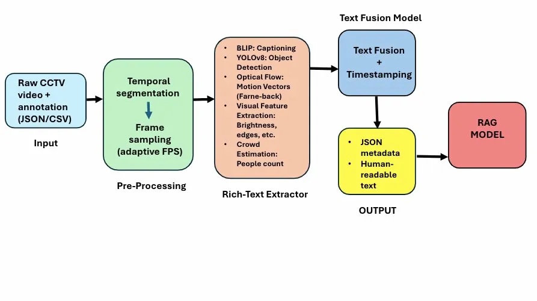
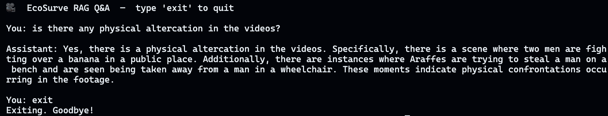

# 🎥 EcoSurve — VLM-Powered Crime Footage Summarisation

A local, end-to-end pipeline that ingests raw surveillance footage, generates
natural-language summaries using a Vision-Language Model (BLIP), and lets you
query those summaries through a RAG-powered chat interface backed by GPT-4o-mini.

---

## 📐 Pipeline Architecture



The pipeline runs in four sequential stages:

| Stage | What happens |
|---|---|
| **1. Frame Sampling** | Video is segmented into 5-second windows; frames are sampled at ~1 fps |
| **2. Captioning** | BLIP generates a natural-language caption for each sampled frame |
| **3. Summarisation** | BART compresses per-segment captions into one sentence, then produces a single incident-level summary |
| **4. RAG Q&A** | Summaries are embedded into ChromaDB; GPT-4o-mini answers questions grounded in retrieved chunks |

---

## 🗂️ Repository Structure

```
EcoSurve/
├── data/
│   └── videos/                  # ← place your .mp4 files here
├── outputs/                     # auto-created on first run
│   ├── summaries/               # per-video .json and .txt summaries
│   └── chroma_db/               # persistent ChromaDB vector index
├── src/
│   ├── config.py                # all tuneable knobs in one place
│   ├── pipeline/
│   │   └── run_pipeline.py      # main entry point
│   ├── rag/
│   │   ├── chat.py              # interactive RAG Q&A REPL
│   │   └── index.py             # ChromaDB build + query helpers
│   ├── summarization/
│   │   └── segment_summarizer.py
│   ├── video/
│   │   ├── frames.py            # frame sampling
│   │   └── io.py                # filesystem helpers
│   └── vlm/
│       └── blip_captioner.py    # BLIP-1 / BLIP-2 wrapper
├── assets/                      # screenshots and diagrams for this README
├── .env                         # your secrets — never committed
├── .gitignore
├── requirements.txt
└── README.md
```

---

## 🎬 Demo Videos

For the purpose of this demo, two assault videos from the
[UCF-Crime dataset](https://www.kaggle.com/datasets/vigneshwar472/ucaucf-crime-annotation-dataset)
are included in `data/videos/`:

- `Assault001_x264.mp4`
- `Assault011_x264.mp4`

The full UCF-Crime dataset is **104 GB** and contains 1 900+ annotated
surveillance videos across 13 crime categories. If you want to run EcoSurve on
the full dataset, download it from Kaggle using the link above and drop the
videos into `data/videos/`.

---

## 🖥️ Example Output

**Segment-level summarisation**


**RAG Q&A**



---

## ⚙️ Prerequisites

| Requirement | Version |
|---|---|
| Python | 3.10 or 3.11 recommended |
| pip | latest |
| OpenAI API key | [platform.openai.com/api-keys](https://platform.openai.com/api-keys) |
| macOS / Linux | Windows untested |

> **Apple Silicon (M1/M2/M3) note:** the pipeline auto-detects MPS and runs on
> it. BLIP inference takes ~4 s/segment on MPS — expect ~2–3 minutes total for
> two 80-second videos.

---

## 🚀 Quickstart

### 1. Clone the repository

```bash
git clone https://github.com/<your-username>/EcoSurve-VLM-powered-Crime-Footage-Summarization.git
cd EcoSurve-VLM-powered-Crime-Footage-Summarization
```

### 2. Create and activate a virtual environment

```bash
python -m venv vlm
source vlm/bin/activate        # macOS / Linux
# vlm\Scripts\activate         # Windows
```

### 3. Install dependencies

```bash
pip install --upgrade pip
pip install -r requirements.txt
```

> First run will also download the BLIP and BART model weights from
> HuggingFace (~2 GB total). Subsequent runs load from the local cache.

### 4. Add your OpenAI API key

Create a `.env` file in the repo root (it is already listed in `.gitignore`
so it will never be committed):

```bash
# .env
OPENAI_API_KEY=sk-proj-YOUR_KEY_HERE
```

> ⚠️ Do **not** wrap the key in quotes.

### 5. Run the full pipeline

```bash
python -m src.pipeline.run_pipeline
```

This will:
- Caption and summarise all videos in `data/videos/`
- Write `.json` and `.txt` summaries to `outputs/summaries/`
- Build the ChromaDB vector index at `outputs/chroma_db/`

### 6. Start the RAG Q&A chat

```bash
python -m src.rag.chat
```

Then ask anything about the footage:

```
You: What happens in Assault001_x264?
You: Is there any physical altercation in the videos?
You: Describe the incident in Assault011.
```

Type `exit` to quit.

---

## 🔧 Advanced Usage

You can override any pipeline parameter directly from the command line:

```bash
# Use a higher-quality BLIP-2 model (requires ~6 GB VRAM)
python -m src.pipeline.run_pipeline --blip_model Salesforce/blip2-opt-2.7b

# Sample more frames per second for denser coverage
python -m src.pipeline.run_pipeline --sample_fps 2.0 --segment_seconds 10.0

# Skip re-captioning if summaries already exist and jump straight to chat
python -m src.pipeline.run_pipeline --skip_summaries --chat

# Skip both summarisation and indexing — just chat against the existing index
python -m src.pipeline.run_pipeline --skip_summaries --skip_index --chat
```

All available flags:

| Flag | Default | Description |
|---|---|---|
| `--videos_dir` | `data/videos` | Directory containing input videos |
| `--summaries_dir` | `outputs/summaries` | Where to write summary files |
| `--chroma_dir` | `outputs/chroma_db` | Where to persist the vector index |
| `--sample_fps` | `1.0` | Frames per second to sample |
| `--segment_seconds` | `5.0` | Duration of each summarisation window |
| `--max_frames_per_segment` | `8` | Hard cap on frames per segment |
| `--blip_model` | `blip-image-captioning-large` | HuggingFace captioner model ID |
| `--summarizer_model` | `bart-large-cnn` | HuggingFace summariser model ID |
| `--embedder_model` | `all-MiniLM-L6-v2` | SentenceTransformers embedder |
| `--top_k` | `4` | Number of chunks retrieved per RAG query |
| `--skip_summaries` | off | Skip captioning/summarisation stage |
| `--skip_index` | off | Skip rebuilding the Chroma index |
| `--chat` | off | Launch RAG chat after pipeline completes |

---

## 📦 Dependencies

```
opencv-python        # video decoding and frame sampling
numpy                # array operations
tqdm                 # progress bars
Pillow               # image conversion for BLIP processor

torch                # model inference (MPS / CUDA / CPU)
transformers==4.56.0 # BLIP captioner + BART summariser
sentence-transformers # text embeddings for ChromaDB
chromadb             # persistent local vector store

accelerate           # efficient HuggingFace model loading
sentencepiece        # tokeniser dependency
python-dotenv        # .env file loading
openai               # OpenAI SDK (used via LangChain)
langchain-openai     # LangChain wrapper for GPT-4o-mini
```

---

## 🔑 Environment Variables

| Variable | Required | Description |
|---|---|---|
| `OPENAI_API_KEY` | ✅ Yes | Used by the RAG chat to call GPT-4o-mini |
| `EMBEDDER_NAME` | ❌ No | Override the embedder when running `chat.py` standalone |

---

## 📝 Output Format

Each processed video produces two files in `outputs/summaries/`:

**`<video_id>.json`** — machine-readable, used by the RAG indexer:
```json
{
  "Assault001_x264": {
    "duration": 83,
    "timestamps": [[0.0, 5.0], [5.0, 10.0], "..."],
    "sentences": ["Segment summary...", "..."],
    "incident_summary": "Overall video-level summary."
  }
}
```

**`<video_id>.txt`** — human-readable for quick inspection:
```
VIDEO: Assault001_x264
DURATION: 83s

INCIDENT SUMMARY:
A man is seen being restrained by several individuals on a street...

SEGMENT SUMMARIES:
[0.00–5.00s]  A man is walking down a street at night...
[5.00–10.00s] Two men are seen struggling near a parked car...
```

---

## ⚠️ Known Limitations

- **BLIP-1 hallucinations** — BLIP occasionally generates nonsensical captions
  (e.g. animal names) on very dark or low-contrast frames. Known hallucination
  tokens are filtered automatically by the pipeline.
- **Caption quality** — BLIP-1-large is optimised for general images, not
  surveillance footage. Upgrading to `Salesforce/blip2-opt-2.7b` significantly
  improves grounding but requires a GPU with ≥6 GB VRAM.
- **RAG quality is bounded by summary quality** — if BLIP captions are generic,
  GPT-4o-mini cannot retrieve or infer details that were never captured.

